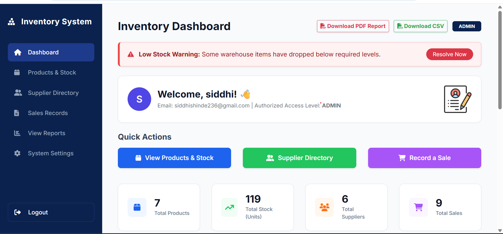
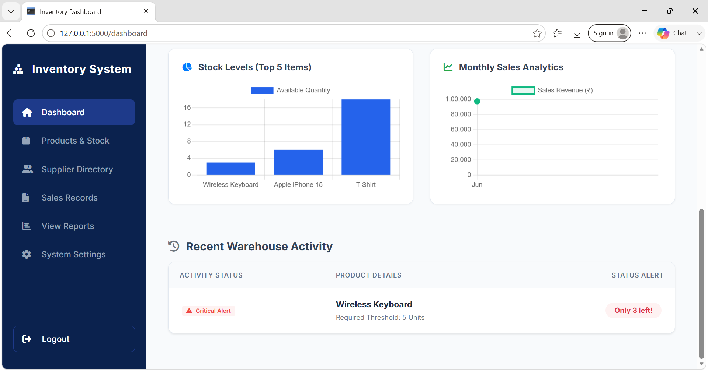
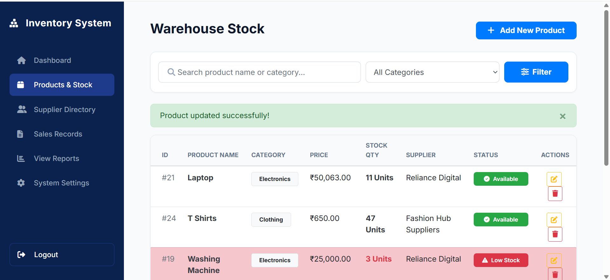
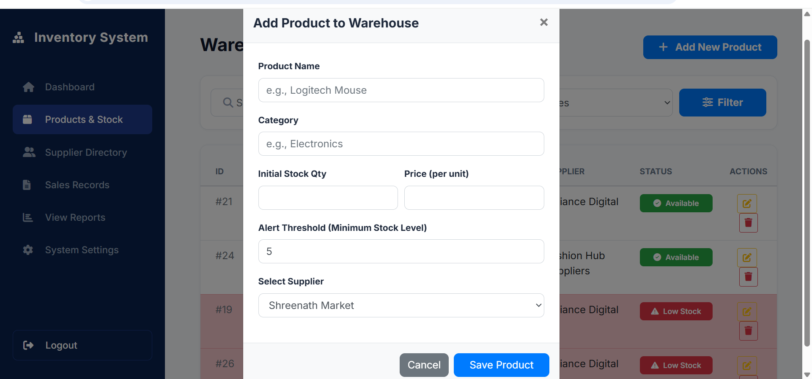
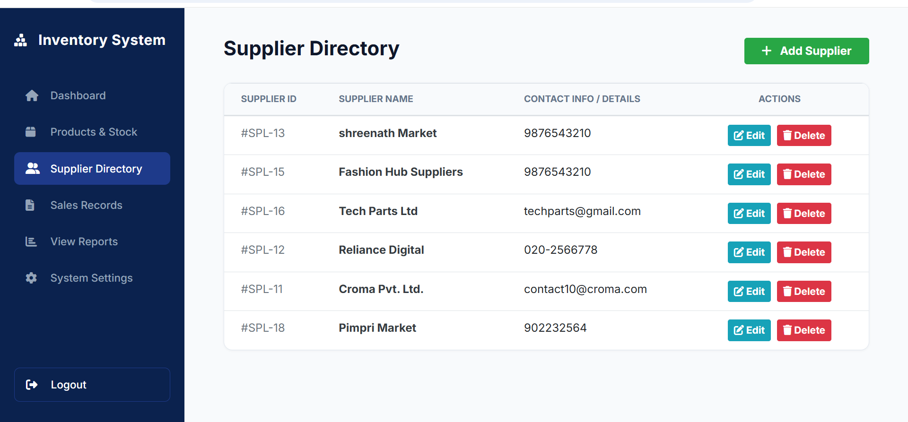
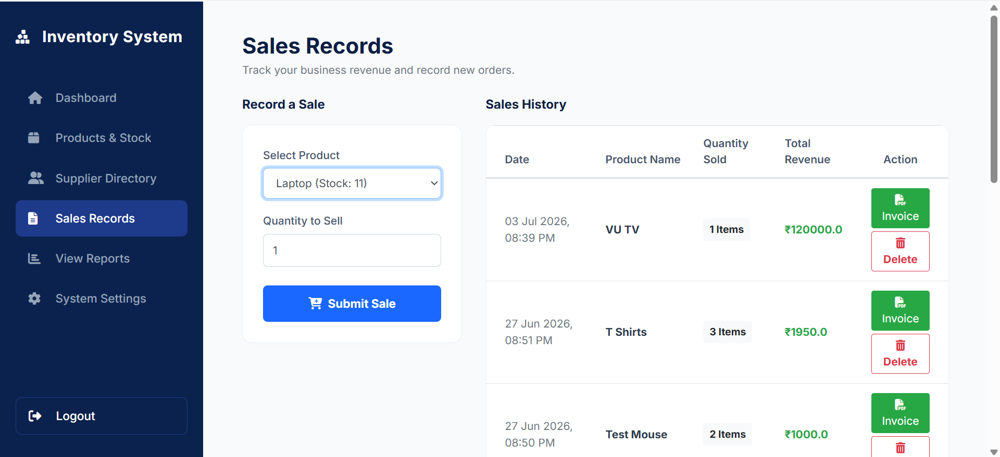
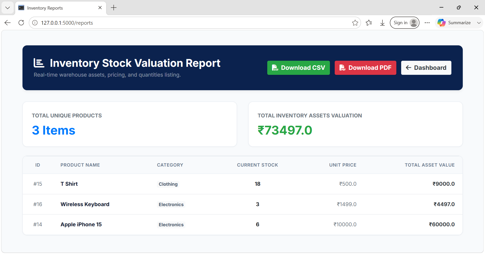
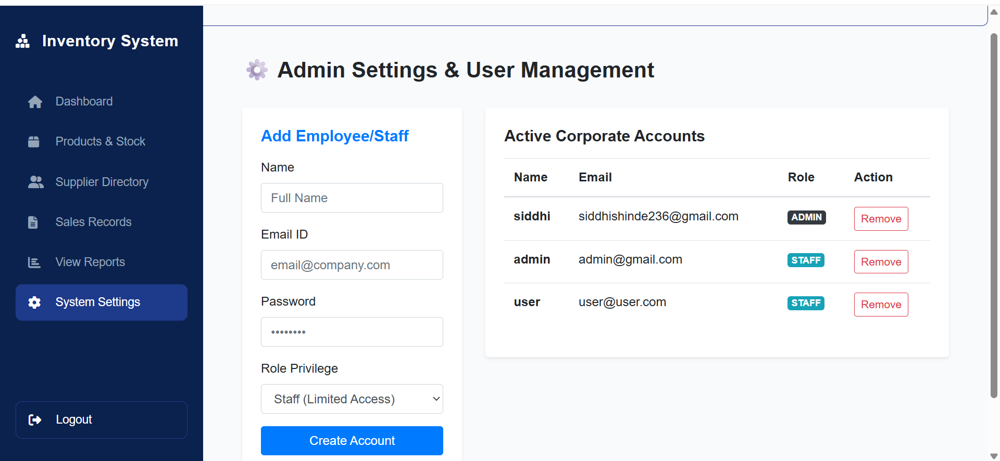

# 📦 Inventory Management System for Small Businesses
 
**Developer:** Siddhi Shinde | Modern College of Arts, Science and Commerce, Pune  
**Tech Domain:** Business / Retail Tech  
**Live Demo:** [Hosted on Render](https://inventory-management-system-8dcl.onrender.com/)  
**GitHub:** [Inventory-Management-System](https://github.com/Siddhi-Shinde-dev/Inventory-Management-System)
 
---
 
## 🧩 Problem Statement
 
Small retail shops and warehouses manually track stock in notebooks or Excel sheets, leading to:
- Stockouts and overstock situations
- Revenue loss due to poor inventory visibility
- No automated alerts for critical stock levels
---
 
## 🎯 Project Objective
 
Build a production-ready, web-based inventory management system where businesses can track products, stock levels, suppliers, and sales. Automated alerts notify managers when stock falls below a threshold.
 
---
 
## ✨ Key Features
 
| Feature | Description |
|---|---|
| 🔐 Role-Based Auth | JWT-based login — Admin (full control) vs Staff (view/update stock only) |
| 📦 Product CRUD | Add, edit, delete products with category, price, quantity, threshold |
| 🏢 Supplier Management | Manage supplier directory with linked products |
| 🛒 Sales Recording | Every sale auto-deducts stock quantity |
| 🚨 Low-Stock Alerts | Dashboard badge + email alert when stock drops below threshold |
| 📊 Dashboard Charts | Bar chart (top selling) + Line chart (monthly sales trend) |
| 📄 Reports | Export inventory reports as PDF or CSV |
| 🧾 Invoice Generation | PDF invoice generated per sale |
| 🔍 Search & Filter | Filter products by name and category |
| 📋 Pagination | Products table with 10 items per page |
 
---
 
## 🛠️ Tech Stack
 
| Layer | Technology |
|---|---|
| Backend | Python, Flask, SQLAlchemy ORM |
| Database | PostgreSQL (Supabase) |
| Frontend | HTML5, CSS3, Bootstrap 4, Chart.js |
| Auth | JWT (PyJWT), bcrypt |
| Reports | ReportLab (PDF), csv (CSV) |
| Email | Flask-Mail, Gmail SMTP |
| Deployment | Render (Web Service) |
| Version Control | GitHub |
 
---
 
## 🗄️ Database Schema
 
```
users          → id, name, email, password (bcrypt), role
products       → id, name, category, quantity, price, threshold, supplier_id
suppliers      → id, name, contact_info
sales          → id, product_id, qty_sold, total_price, sale_date
```
 
**Relationships:**
- `products.supplier_id` → `suppliers.id` (CASCADE DELETE)
- `sales.product_id` → `products.id` (CASCADE DELETE)
---
 
## ⚙️ Local Setup & Installation
 
### 1. Clone the Repository
```bash
git clone https://github.com/Siddhi-Shinde-dev/Inventory-Management-System.git
cd Inventory-Management-System
```
 
### 2. Install Dependencies
```bash
pip install -r requirements.txt
```
 
### 3. Create `.env` File
Create a `.env` file in the root directory:
```
SUPABASE_PASSWORD=your_supabase_db_password
MAIL_USERNAME=your_gmail@gmail.com
MAIL_PASSWORD=your_gmail_app_password
SECRET_KEY=your_flask_secret_key
JWT_SECRET=your_jwt_secret_key
```
 
> **Note:** For Gmail, use an App Password (not your main password).  
> Generate at: Google Account → Security → 2-Step Verification → App Passwords
 
### 4. Run the Application
```bash
python app.py
```
 
Open browser: `http://127.0.0.1:5000`
 
---
 
## 👤 Default Login
 
| Role | Email | Password |
|---|---|---|
| Admin | Register via `/register` | Set during registration |
| Staff | Created by Admin via Settings | Set by Admin |
 
---
 
## 📁 Project Structure
 
```
Inventory-Management-System/
│
├── app.py                  # Main Flask application
├── requirements.txt        # Python dependencies
├── .env                    # Environment variables (not tracked)
├── .gitignore
├── README.md
│
└── templates/
    ├── index.html          # Landing page
    ├── login.html          # Login page
    ├── register.html       # Register page
    ├── dashboard.html      # Main dashboard with charts
    ├── products.html       # Product listing with search/filter/pagination
    ├── edit_product.html   # Edit product form
    ├── suppliers.html      # Supplier directory
    ├── edit_supplier.html  # Edit supplier form
    ├── sales.html          # Sales recording
    ├── reports.html        # Reports with charts
    └── settings.html       # Admin user management
```
 
---
 
## 📸 Screenshots
 
| Page | Screenshot |
|---|---|
| Dashboard |  |
| Dashboard Charts |  |
| Warehouse Stock |  |
| Add Product |  |
| Supplier Directory |  |
| Sales Records |  |
| Valuation Report |  |
| Admin Settings |  |
 
---
 
## 🚀 Deployment (Render)
 
1. Push code to GitHub
2. Go to [render.com](https://render.com) → New Web Service
3. Connect GitHub repository
4. Set **Start Command:** `gunicorn app:app`
5. Add Environment Variables (from `.env`) in Render dashboard
6. Deploy!
---
 
## 📚 Concepts Demonstrated
 
- OOP with Flask (Models, Decorators, Helper Functions)
- REST API design
- JWT Authentication & Role-Based Access Control
- Exception Handling
- File I/O — PDF & CSV generation
- Email Automation via SMTP
- Data Aggregation with SQLAlchemy
- Chart.js data visualization
---
 
## 🔮 Future Enhancements
 
- Barcode scanner input
- Demand forecasting (ML)
- Multi-location warehouse support
- Mobile-responsive PWA
- Razorpay billing integration
---
